# Suricata SOC Investigation for Splunk

Suricata SOC Investigation is a Splunk app for investigating Suricata IDS alert data. It provides SOC-focused dashboards for alert overview, anomaly detection, target risk scoring, MITRE ATT&CK mapping, lookup management, and incident investigation.

Splunkbase app page:
https://splunkbase.splunk.com/app/8559

This repository is a usage guide for the app. It is intended for analysts and Splunk administrators who want to install, configure, and operate the app.

---

## What the App Does

- Summarises Suricata alert activity across time, source, destination, protocol, signature, and severity.
- Helps analysts identify noisy sources, frequently triggered signatures, targeted hosts, and possible scanning activity.
- Provides investigation views by source IP and destination IP.
- Reconstructs short attack sessions in an incident timeline view.
- Maps Suricata signatures to MITRE ATT&CK tactics and techniques.
- Highlights unmapped signatures so MITRE coverage can be improved over time.
- Provides editable lookup-based configuration for MITRE mappings and saved dashboard defaults.

---

## Splunkbase

Install the app from Splunkbase:

https://splunkbase.splunk.com/app/8559

After installation, open the app from the Splunk App Launcher:

```text
Suricata SOC Investigation
```

---

## Required Data

The app expects Suricata alert events to already be indexed and searchable in Splunk.

> Note: This app does not collect or ingest Suricata logs. It analyses Suricata data that is already available in Splunk.

Typical Suricata fields used by the dashboards include:

- `event_type`
- `src_ip`
- `dest_ip`
- `src_port`
- `dest_port`
- `proto`
- `alert.signature`
- `alert.category`
- `alert.severity`

The default search scope is:

```text
index=suricata
```

If your data is stored somewhere else, use the Search Scope dashboard to change the app-wide default.

> Tip: Start by opening the Search Scope dashboard. If the preview table returns events, the rest of the dashboards are much more likely to work as expected.

---

## Dashboard Guide

### Anomaly Detection

Use this dashboard to find unusual Suricata activity, such as event spikes, noisy source IPs, and high-volume signatures.

Screenshot:

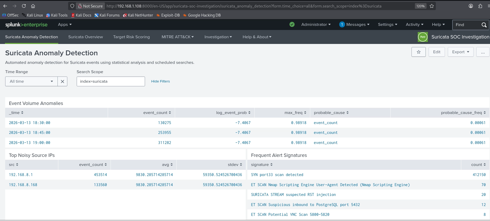

### Suricata Overview

Use this dashboard for the first high-level review of Suricata alert activity. It shows alert trends, top signatures, top sources, targeted hosts, protocol distribution, possible port scanners, and recent alerts.

Screenshot:

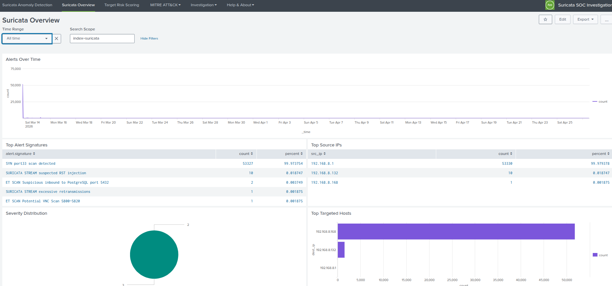

### Target Risk Scoring

Use this dashboard to rank destination hosts by alert volume and severity. This helps decide which targets should be investigated first.

Screenshot:

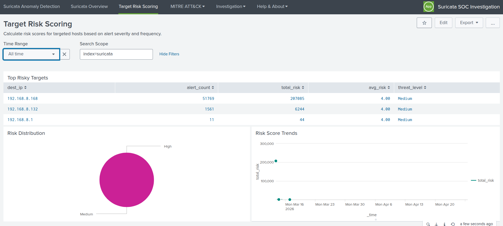

### MITRE ATT&CK Mapping

Use this dashboard to view Suricata alert activity by MITRE ATT&CK tactic and technique.

Screenshot:

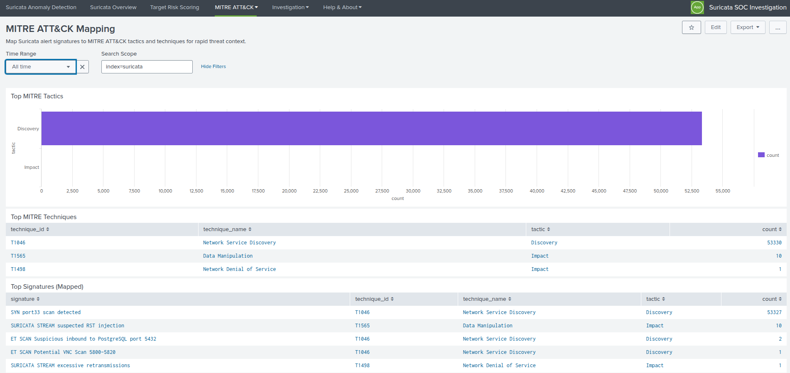

### Unknown MITRE Coverage

Use this dashboard to find Suricata signatures that are not yet mapped in the MITRE lookup.

Screenshot:

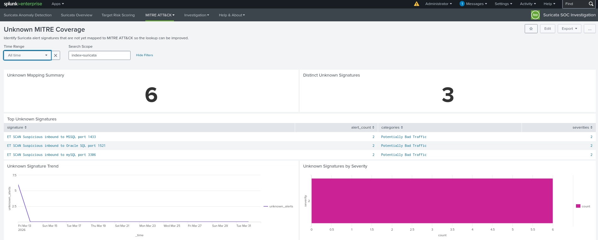

### MITRE Lookup Editor

Use this dashboard to search, add, update, and delete MITRE mappings from inside the app.

Screenshot:

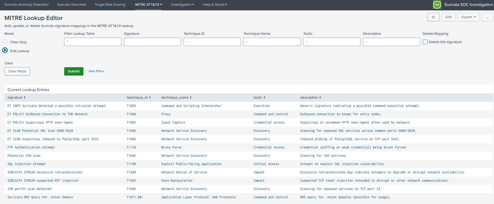

### Suricata Investigation

Use this dashboard to investigate activity by source IP and destination IP.

Screenshot:

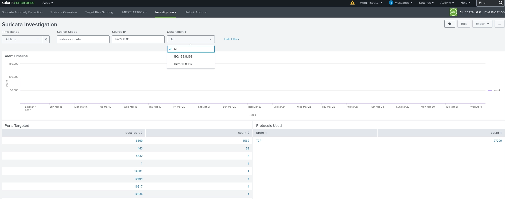

### Incident Timeline

Use this dashboard to reconstruct short attack sessions for a selected source IP.

Screenshot:

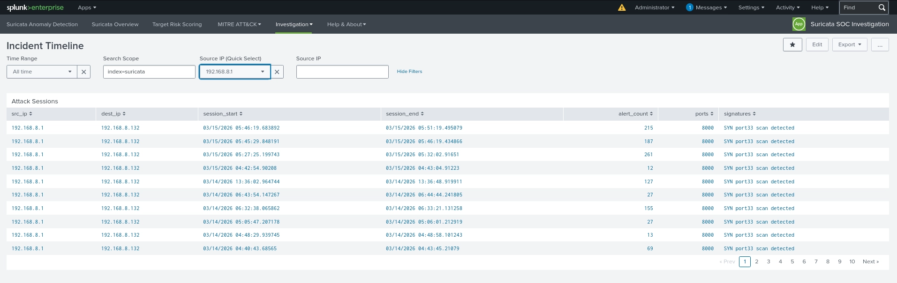

### Search Scope

Use this dashboard to set the default search scope and time range used by the app dashboards.

Screenshot:

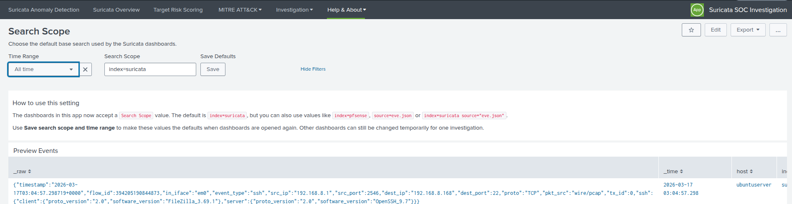

---

## Search Scope and Time Range

The app uses a saved settings lookup to remember the default search scope and time range.

Settings lookup:

```text
lookups/suricata_settings.csv
```

Example:

```csv
setting,value
search_scope,index=suricata
time_choice,24h
```

Supported time range values:

```text
24h
7d
30d
all
```

Changing Search Scope or Time Range directly on a dashboard is useful for one investigation session. To change the saved defaults, update `suricata_settings.csv`.

> Note: Saved defaults are intended for administrators. Analysts can still adjust Search Scope and Time Range temporarily on individual dashboards.

---

## CSV Lookup Files

The app uses two main CSV lookup files.

### MITRE mapping lookup

```text
lookups/suricata_mitre.csv
```

This file controls Suricata signature to MITRE ATT&CK mapping.

Columns:

```csv
signature,technique_id,technique_name,tactic,description
```

### App settings lookup

```text
lookups/suricata_settings.csv
```

This file controls saved dashboard defaults.

Columns:

```csv
setting,value
```

---

## Editing CSV Lookups

Splunk administrators have three practical options for editing the app CSV lookups.

> Recommendation: Use the in-app editor for quick MITRE mapping updates, use Splunk App for Lookup File Editing for larger CSV maintenance, and use manual file editing for packaging or scripted changes.

### Option 1: Use the In-App MITRE Lookup Editor

Best for quick MITRE mapping updates from inside the Suricata SOC Investigation app.

Steps:

1. Open the app in Splunk.
2. Go to:

   ```text
   MITRE ATT&CK -> MITRE Lookup Editor
   ```

3. Use Filter Only mode to search existing mappings.
4. Switch to Edit Lookup mode to add, update, or delete a mapping.
5. Submit the change.

Splunk may show a security warning because the app uses `outputlookup` to save CSV changes. This is expected when saving lookup changes from a dashboard.

> Important: Only trusted users who are allowed to edit lookup files should save changes from the in-app editor.

Screenshots:

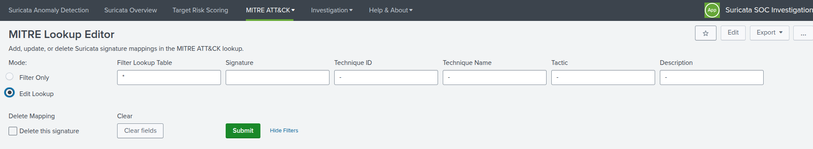

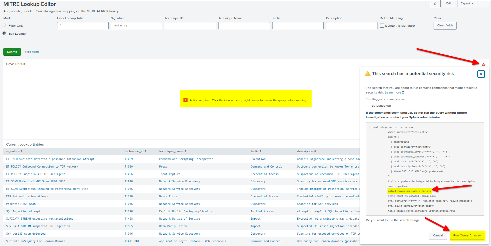

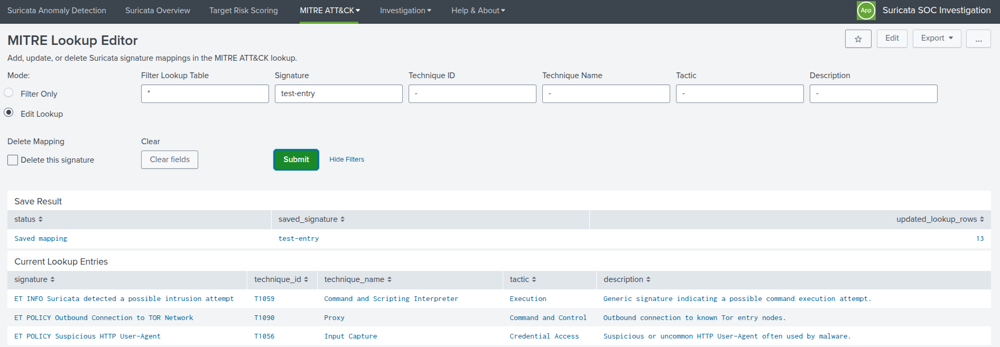

### Option 2: Use Splunk App for Lookup File Editing

Best for administrators who want a spreadsheet-style editor for CSV lookups.

Install the `Splunk App for Lookup File Editing` from Splunkbase:

https://splunkbase.splunk.com/app/1724

After installation, use it to edit:

```text
suricata_mitre.csv
suricata_settings.csv
```

This option is useful for bulk edits, review, and easier CSV management.

> Tip: This is the friendliest option when you need to edit many rows at once.

Screenshot:

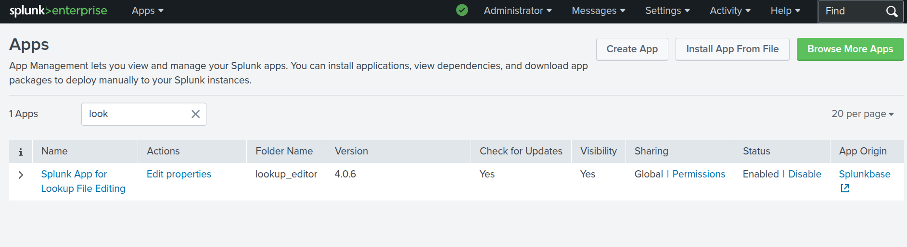

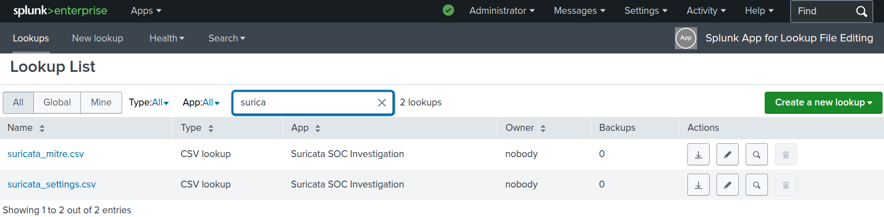

### Option 3: Edit the CSV Files Manually

Best for packaging, version control, scripted updates, or server-side maintenance.

Files:

```text
$SPLUNK_HOME/etc/apps/suricata-soc-investigation/lookups/suricata_mitre.csv
$SPLUNK_HOME/etc/apps/suricata-soc-investigation/lookups/suricata_settings.csv
```

After manual changes, refresh Splunk knowledge objects or restart Splunk if needed.

> Warning: Be careful when editing CSV files manually. Keep the header row unchanged and back up the file before large edits.

Useful refresh URL:

```text
http://YOUR_SPLUNK:8000/en-US/debug/refresh
```

<!-- Screenshot:

 -->

---

## Recommended Admin Workflow

1. Install the app from Splunkbase.
2. Confirm Suricata data is searchable in Splunk.
3. Open the Search Scope dashboard and confirm the app is searching the correct data.
4. Review the Overview and Anomaly Detection dashboards.
5. Check Unknown MITRE Coverage.
6. Update MITRE mappings using one of the lookup editing options.
7. Use Investigation and Incident Timeline dashboards for deeper analysis.

---

## Troubleshooting

### Dashboards are empty

Check the Search Scope and Time Range. Make sure the scope matches where your Suricata data is stored.

Examples:

```text
index=suricata
index=suricata2
source=eve.json
index=suricata source=eve.json
```

### MITRE panels show Unknown

This means the Suricata signature is not yet mapped in `suricata_mitre.csv`. Use Unknown MITRE Coverage and the MITRE Lookup Editor to add missing mappings.

### Splunk shows an outputlookup warning

This is expected when saving lookup changes from a dashboard. Only users who are allowed to edit lookups should run the save action.

> Note: The warning is Splunk's normal protection for commands that write data, such as `outputlookup`.

### If changes do not appear immediately

Refresh Splunk knowledge objects:

```text
http://YOUR_SPLUNK:8000/en-US/debug/refresh
```

or restart Splunk if required by your deployment.

---

## Known Notes

- This app does not ingest Suricata logs by itself.
- Suricata data must already be indexed and searchable in Splunk.
- The app is designed for Suricata IDS alert investigation.

---

## Support

Developer: Kaled Aljebur

Email:

```text
kaledaljebur@gmail.com
```

Contact me if you need a customised version of this app or a custom Splunk app for your environment.